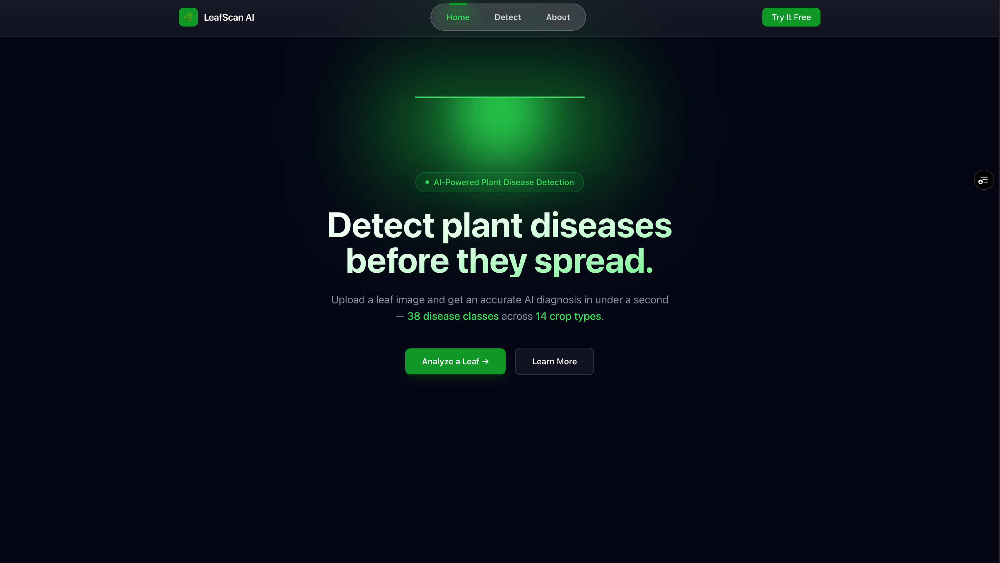
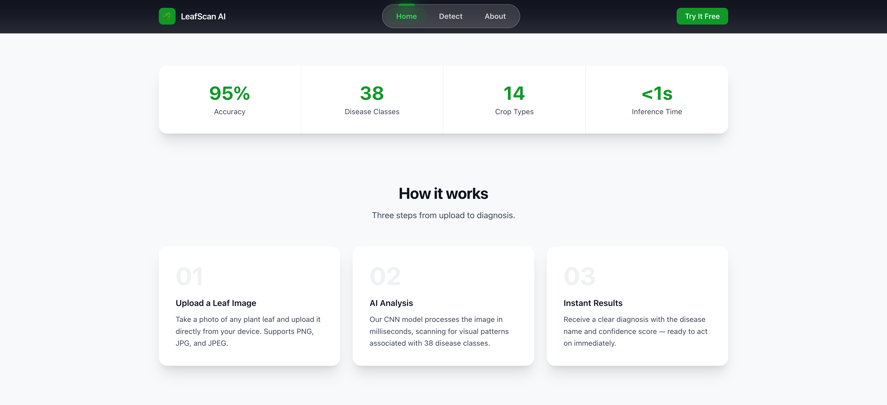
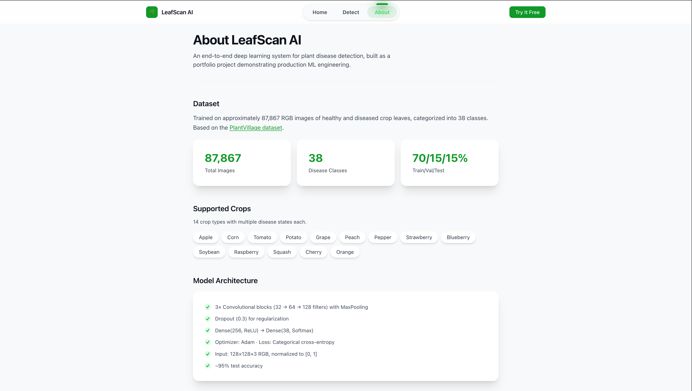
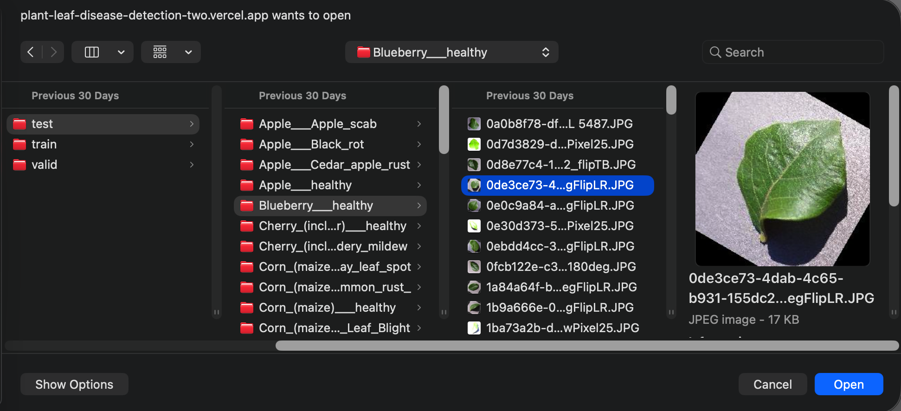
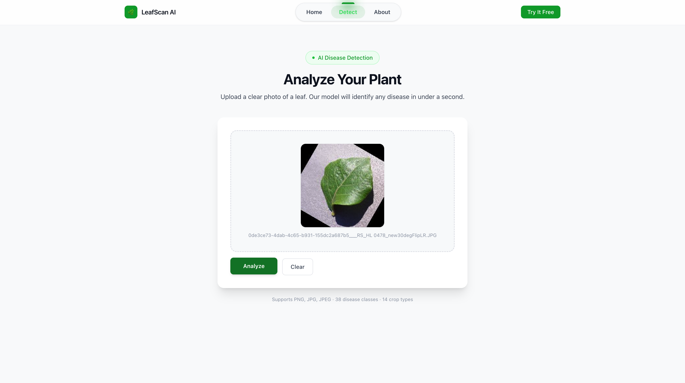
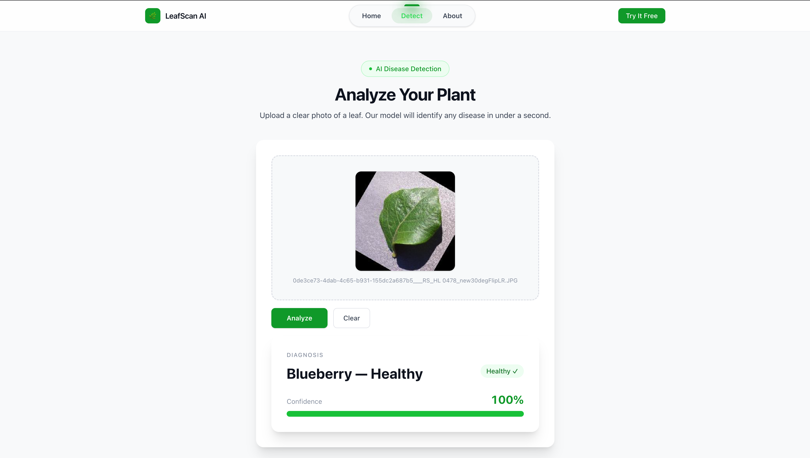
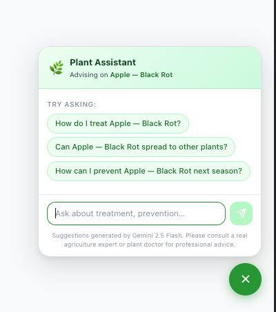

# 🌿 Plant Disease Recognition System

A production-ready deep learning system for identifying plant diseases from leaf images using CNNs. **Next.js + FastAPI** web app with a legacy Streamlit option.

**Accuracy:** ~95% on 38 disease classes across 14 crop types

### 🚀 Live Demo

**[LeafScan AI →](https://plant-leaf-disease-detection-two.vercel.app/)** — Upload a leaf image and get an AI diagnosis in under a second.

---

## 📋 Table of Contents

- [Features](#-features)
- [UI Screenshots](#-ui-screenshots)
- [AI Plant Assistant](#-ai-plant-assistant)
- [Architecture](#-architecture)
- [Directory Structure](#-directory-structure)
- [Quick Start](#-quick-start)
- [Usage](#-usage)
- [Dataset & Disease Classes](#-dataset--disease-classes)
- [Model Architecture](#-model-architecture)
- [Model Training](#-model-training)
- [Security](#-security)
- [CI/CD and Deployment](#-cicd-and-deployment)
- [Contributing](#-contributing)
- [License](#-license)

---

## ✨ Features

- **38 Disease Classes** across 14 crop types (Apple, Corn, Tomato, Potato, Grape, Peach, Pepper, Strawberry, Blueberry, Soybean, Raspberry, Squash, Cherry, Orange)
- **Non-Leaf Rejection** — Rejects out-of-distribution images (tools, people, random objects) before inference
- **Plant Assistant (AI Chat)** — Built-in AI assistant powered by **Gemini 2.5 Flash** for personalized treatment, prevention, and spread advice based on the detected disease
- **Production-Ready** — Centralized config, reproducible training, FastAPI + Next.js
- **Fast Inference** — Model caching, &lt;1s per prediction

---

## 📸 UI Screenshots

**Landing**




**About**



**Disease detection flow**





**Plant Assistant (AI Chat powered by Gemini)**



The Plant Assistant appears after a disease is detected. Ask about treatment, prevention, or whether the disease can spread — suggestions are generated by Gemini 2.5 Flash. Please consult a real agriculture expert for professional advice.

---

## 🤖 AI Plant Assistant

After a leaf image is analyzed and a disease is detected, you can open the **Plant Assistant** (floating chat icon in the bottom-right) to get personalized advice powered by **Google Gemini 2.5 Flash**.

| Capability | Description |
|------------|-------------|
| **Context-aware** | Uses the detected disease (e.g. Apple — Black Rot) to tailor responses |
| **Treatment & prevention** | Ask "How do I treat...?", "How can I prevent... next season?" |
| **Spread info** | Ask "Can this disease spread to other plants?" |
| **Server-side** | Chat goes through `/api/chat` proxy — Gemini API key stays on the server |

**Setup:** Set `GEMINI_API_KEY` in your Vercel and Railway environment variables to enable the assistant.

---

## 🏗️ Architecture

### Helicopter view

```
┌─────────────────────────────────────────────────────────────────────────────────┐
│                    PLANT DISEASE RECOGNITION — END-TO-END FLOW                    │
└─────────────────────────────────────────────────────────────────────────────────┘

  ML PIPELINE (offline)
  ┌─────────────┐      ┌─────────────┐      ┌─────────────┐
  │   DATASET   │ ───► │   TRAINING  │ ───► │   MODEL     │
  │ PlantVillage│      │  Notebook   │      │  CNN (.h5)  │
  │ 87K images  │      │ config +    │      │ 38 classes  │
  │ 38 classes  │      │ pipeline    │      │ ~95% acc    │
  └─────────────┘      └─────────────┘      └──────┬──────┘
                                                   │
  USER FLOW (online)                               │ deploy
  ┌─────────────┐      ┌─────────────┐      ┌─────▼─────┐      ┌─────────────┐
  │   USER      │ ───► │   VERCEL    │ ───► │  RAILWAY  │ ───► │   RESULT    │
  │ Upload leaf │      │  Next.js     │      │  FastAPI   │      │ Disease +   │
  │   image     │      │ /api/predict │      │ + CNN     │      │ Confidence  │
  └─────────────┘      └─────────────┘      └───────────┘      └─────────────┘
```

### Deployment flow

```
Data Pipeline → Training (Notebook) → Saved Model (.h5)
                                          │
                    ┌─────────────────────┴─────────────────────┐
                    ▼                                           ▼
         Vercel (Next.js) ──POST /api/predict──► Railway (FastAPI)
         LeafScan AI UI    (server proxy)         Docker + model
```

- **Frontend:** Next.js calls `/api/predict` (server-side proxy). API key and backend URL never reach the browser.
- **Backend:** FastAPI on Railway handles `/predict` with rate limiting, API key auth, and input validation.

---

## 📁 Directory Structure

```
├── config.py              # Hyperparameters, class names
├── data_pipeline.py       # Preprocessing & augmentation
├── main.py                # Streamlit app (legacy)
├── api/
│   ├── main.py            # FastAPI: /predict, /health, validation, rate limiting
│   └── requirements.txt
├── frontend/              # Next.js + React
│   ├── src/app/api/predict/   # Server proxy (keeps API key server-side)
│   └── src/components/
├── Train_plant_disease.ipynb
├── Test_plant_disease.ipynb
├── images/                # UI screenshots
└── .github/workflows/ci.yml
```

---

## 🚀 Quick Start

### Next.js + FastAPI (Recommended)

1. Place `trained_plant_disease_model.h5` in `Prev Models/` or project root
2. Start API: `pip install -r api/requirements.txt && uvicorn api.main:app --reload --port 8000`
3. Start frontend: `cd frontend && npm install && npm run dev`
4. Open [http://localhost:3000](http://localhost:3000) → **Disease Recognition**

### Streamlit (Legacy)

`streamlit run main.py` → [http://localhost:8501](http://localhost:8501)

---

## 📖 Usage

### Training

1. Open `Train_plant_disease.ipynb` and run cells in order
2. Uses canonical pipeline (`config.py` + `data_pipeline.py`)
3. Model saved as `trained_plant_disease_model.h5`

### Upload Requirements

- **Formats:** PNG, JPG, JPEG, WebP, GIF
- **Max size:** 10 MB
- **Max dimensions:** 4096×4096 px
- Non-leaf images are rejected with a clear error before inference

---

## 📊 Dataset & Disease Classes

The model is trained on the **Plant Village** dataset (or similar public plant-disease dataset).

| Metric | Value |
|--------|-------|
| **Total images** | ~87,867 |
| **Disease classes** | 38 |
| **Crop types** | 14 (Apple, Corn, Tomato, Potato, Grape, Peach, Pepper, Strawberry, Blueberry, Soybean, Raspberry, Squash, Cherry, Orange) |
| **Train / Valid / Test** | 70% / 15% / 15% |

**Structure:** `data/train/`, `data/valid/`, `data/test/` with class subdirs (e.g. `Apple___Apple_scab/`, `Tomato___Late_blight/`).

---

## 🧠 Model Architecture

A CNN with **Conv2D → MaxPool** blocks followed by dense layers:

| Layer | Details |
|-------|---------|
| Conv2D | 32 filters, 3×3, ReLU, same padding |
| MaxPool2D | 2×2 |
| Conv2D | 64 filters, 3×3, ReLU |
| MaxPool2D | 2×2 |
| Conv2D | 128 filters, 3×3, ReLU |
| MaxPool2D | 2×2 |
| Dropout | 0.3 |
| Flatten | — |
| Dense | 256 units, ReLU |
| Dense | 38 units, Softmax |

**Input:** 128×128×3 RGB, normalized [0, 1]  
**Output:** 38-class probability distribution

---

## 🔄 Model Training

Training uses the canonical pipeline (`config.py` + `data_pipeline.py`) as the single source of truth for preprocessing. The notebook `Train_plant_disease.ipynb` runs cells in order:

1. **Set seed** — `set_global_seed(42)` for reproducibility
2. **Build datasets** — `build_training_dataset()`, `build_validation_dataset()`, `build_test_dataset()` with shared normalization
3. **Define CNN** — Sequential model with Conv2D blocks and dense layers
4. **Train** — Adam optimizer (lr=1e-4), categorical cross-entropy, up to 20 epochs with early stopping and learning-rate reduction
5. **Save** — Model saved as `trained_plant_disease_model.h5`; experiment logs saved to `experiments/`

**Data augmentation (train only):** Random flip (horizontal + vertical), random rotation (±10°), random zoom (±10%), random brightness (±10%).

**Training time:** ~6–8 hours on CPU/GPU depending on hardware.

---

## 🔒 Security

| Measure | Implementation |
|---------|----------------|
| **Rate limiting** | 10 requests/min per IP (configurable via `RATE_LIMIT` env). Applied at both Vercel proxy and Railway backend. |
| **Input validation** | File size ≤10 MB, magic-byte image type check (JPEG/PNG/WebP/GIF), max dimensions 4096×4096 px. Non-leaf colour heuristic + low-confidence guard before inference. |
| **API key handling** | Backend requires `X-API-Key` header when `API_KEY` env is set on Railway. Frontend uses server-side proxy (`/api/predict`) — API key and backend URL never exposed to the browser. |

**Env vars (production):**

- **Railway:** `API_KEY`, `MODEL_URL`, `CORS_ORIGINS`, `GEMINI_API_KEY` (optional, for Plant Assistant chat)
- **Vercel:** `API_URL` (Railway URL), `API_KEY` (same as Railway), `GEMINI_API_KEY` (optional, for Plant Assistant) — no `NEXT_PUBLIC_` prefix

---

## 🚀 CI/CD and Deployment

### GitHub Actions

- Lint (Ruff) + smoke test on push/PR. See [`.github/workflows/ci.yml`](.github/workflows/ci.yml)

### Railway + Vercel

**Backend (Railway):**

- Deploy from GitHub. Set `MODEL_URL` (direct download for .h5), `API_KEY`, `CORS_ORIGINS`
- Generate public domain in Settings → Networking

**Frontend (Vercel):**

- Root directory: `frontend`
- Env vars: `API_URL` = Railway URL, `API_KEY` = same secret (server-side only), `GEMINI_API_KEY` = for Plant Assistant chat (optional)

---

## 🤝 Contributing

1. Fork, create a branch, make changes
2. Run training notebook and test the app
3. Submit a pull request

---

## 📄 License

Open source for educational and research use. Comply with dataset licenses when using external data.

---

**Last Updated:** March 2026
